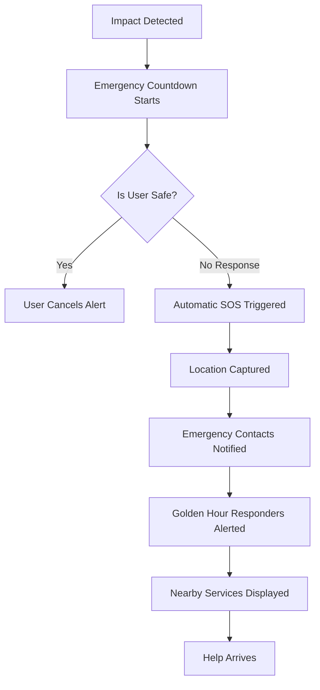
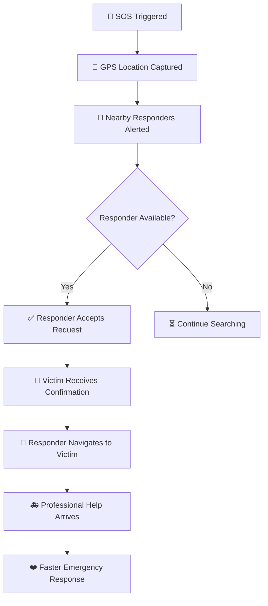
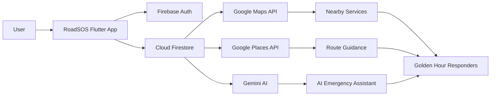
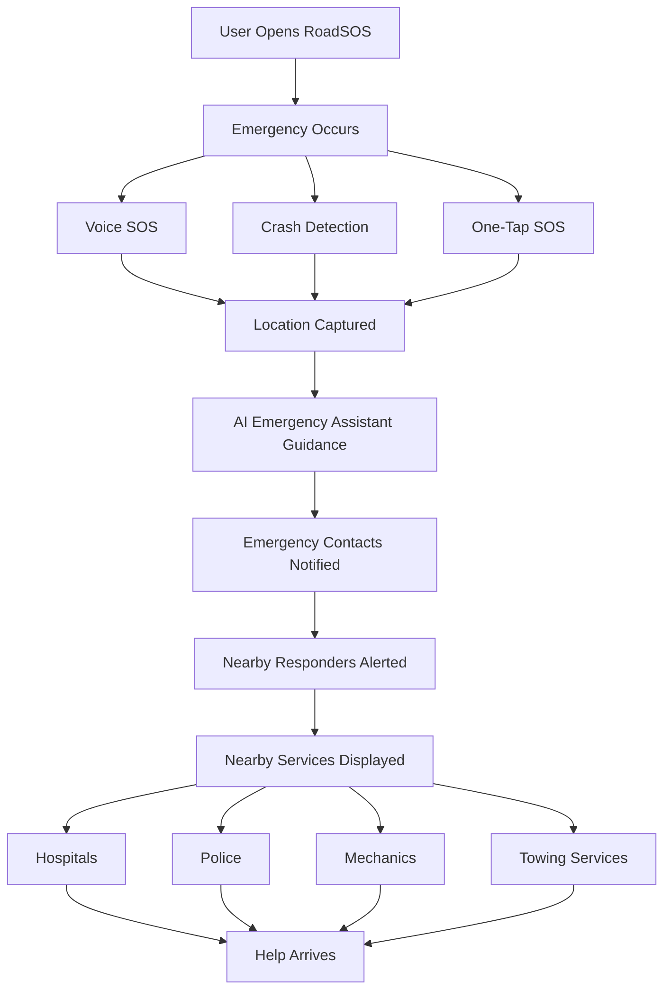

<div align="center">

# 🚨 RoadSOS

### Emergency Help, Always Ready
### Not just for accidents — for every road emergency

### 👨‍💻 Team: NextGen Devs

| Role | Name |
|------|------|
| 🏆 Team Leader | **Srividhya Ganesan** |
| 👨‍💻 Team Member | **Radni Amonkar** |
| 👨‍💻 Team Member | **Prakriti Ranjan** |

### 🏫 Goa College of Engineering
### Farmagudi, Ponda, Goa

<br>


<br>

**🚑 One-Tap SOS • 🎙️ Voice SOS • 🚗 Crash Detection • 🤖 AI Emergency Assistant • 🦸 Golden Hour Responders • 📍 Nearby Services**

</div>

---

## 📱 About RoadSOS

RoadSOS is an AI-powered emergency response and roadside assistance application built using Flutter. It helps users during accidents, vehicle breakdowns, and medical emergencies by providing instant SOS activation, crash detection, nearby service discovery, offline emergency support, and community-powered Golden Hour responders.

## 📱 Overview

RoadSOS provides users with instant access to emergency services, nearby hospitals, police stations, towing services, mechanics, and volunteer responders.

The app is designed to function even in low-connectivity environments through offline caching and emergency SMS capabilities.

---
## ✨ Key Features

🚑 One-Tap SOS
- Instant emergency activation
- GPS location sharing
- Emergency contact alerts
- Google Maps location link
- Timestamp generation
- Offline SMS support
---
## 🎙️ Voice SOS

Users can activate SOS using voice commands.

Supported phrases:

- SOS
- Help
- Bachao
- Madad
- Udhavi
- Sahayam

Features:

- Hands-free activation
- Multilingual support
- Accessibility friendly
---
## 🚗 Auto Crash Detection

RoadSOS automatically detects severe impacts using phone sensors.

Uses:

- Accelerometer
- G-Force Monitoring
- Countdown Timer
- Haptic Feedback
- Text-To-Speech Alerts

## 🚗 Auto Crash Detection Workflow


---
## 🤖 AI Emergency Assistant

AI-powered chatbot that assists users during emergencies.

Capabilities:

- Medical Assistance
- CPR guidance
- First aid instructions
- Bleeding control
- Fracture handling
- Vehicle Assistance
- Flat tyre troubleshooting
- Battery issues
- Engine problem guidance
- Emergency Support
- Nearby hospitals
- Nearby mechanics
- Nearby towing services
- Emergency recommendations
---
## 🦸 Golden Hour Responder Network

A community-powered emergency response system that connects accident victims with nearby volunteer responders during the critical Golden Hour.



Goal:

Reduce response time during the Golden Hour.
---
## 📍 Nearby Services

Find nearby:

- Hospitals
- Trauma Centres
- Ambulance Services
- Police Stations
- Mechanics
- Towing Services
- Puncture Shops

Features:

- Distance calculation
- Ratings
- Open / Closed status
- Direct call support
- Google Maps navigation
---
## 📶 Offline First Architecture

RoadSOS continues working even when internet connectivity is unavailable.

## Offline Features:

- Emergency Contacts
- Emergency Numbers
- Cached Nearby Services
- Emergency SMS
- First Aid Guides

---
👤 User Profile

Store critical information:

- Name
- Blood Group
- Allergies
- Medical Conditions
- Vehicle Details
- Registration Number

This information can assist responders during emergencies.
---
## ☎ Emergency Contacts

Features:

- Add Emergency Contacts
- Set Primary Contact
- Quick Calling
- National Emergency Numbers
- Women Helpline
- Road Accident Helpline
- Guest Mode Contacts

## Supported emergency numbers include:

- Service	Number
- National Emergency	112
- Ambulance	108
- Police	100
- Fire Brigade	101
- Road Accident Helpline	1073
- Women Helpline	1091
---

## 🏗️ RoadSOS Architecture



---

## 📂 Folder Structure

```text
ROADSOS
│
├── android/
├── ios/
├── linux/
├── macos/
├── web/
├── windows/
│
├── lib/
│   ├── models/
│   │
│   ├── screens/
│   │   ├── chatbot_screen.dart
│   │   ├── crash_alert_screen.dart
│   │   ├── emergency_contacts_screen.dart
│   │   ├── home_screen.dart
│   │   ├── login_screen.dart
│   │   ├── main_shell.dart
│   │   ├── nearby_services_screen.dart
│   │   ├── offline_screen.dart
│   │   ├── profile_screen.dart
│   │   ├── responder_alert_screen.dart
│   │   ├── sos_active_screen.dart
│   │   └── splash_screen.dart
│   │
│   ├── services/
│   ├── theme/
│   ├── widgets/
│   │
│   ├── firebase_options.dart
│   ├── main.dart
│   └── secrets.dart
│
├── test/
├── pubspec.yaml
└── README.md
```

- Based on the actual project structure and screens.
---
## 🛠 Technology Stack
- Frontend
- Flutter
- Dart
- Backend
- Firebase Authentication
- Cloud Firestore
- Storage
- Hive Database
- Local Cache
- Maps & Location
- Google Maps API
- Google Places API
- Geolocator
- Geocoding
- AI
- Google Gemini API
- Packages
- speech_to_text
- flutter_tts
- sensors_plus
- connectivity_plus
- url_launcher
- google_fonts
- shared_preferences
---
## 🔄 User Flow


---
## Problem Solved

RoadSOS addresses:

- Delayed Ambulance Response
- No Hospital Discovery
- Connectivity Gaps
- Language Barriers
- Stranded Drivers
- Lack of Immediate First Responders
---
## 🔮 Future Scope
- AI Accident Prediction
- Smartwatch SOS Integration
- Ambulance Tracking
- Government Emergency Integration
- Insurance Integration
- Emergency Video Streaming
- AI Route Optimization
- Smart Responder Matching
